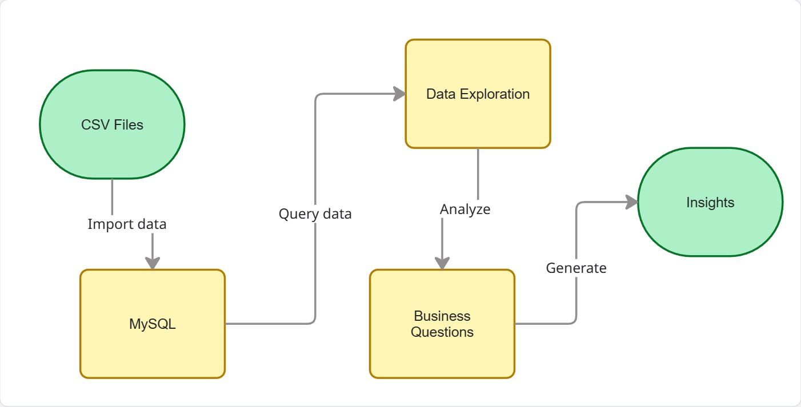

# airbnb-sql-analysis

SQL-based analysis of Airbnb listings to identify pricing patterns, demand concentration, and investment opportunities.

## Dataset
Source: Inside Airbnb  
https://insideairbnb.com/denver/

### Data Scope
- The original dataset contains historical data across multiple years.
- Due to size constraints, only reviews from **September 2025** were used in this analysis.

## Data Model

### Primary Key
The original CSV import did not define a primary key.  
After validating that the `id` column contains unique and non-null values, it was defined as the primary key to ensure data integrity and support joins across tables.

### Relationships

## Data Model & Relationships

- `listings.id` is the primary key of the listings table.
- `reviews.listing_id` acts as a logical foreign key referencing `listings.id`.
- `neighbourhood_group` exists as a geographical attribute; however, its population in the listings table is limited and therefore not used for district-level analysis.

Foreign key constraints were not physically enforced, as this is an analytical dataset.

### Data Quality Notes

During validation, one listing was found with a `neighbourhood_group` value that does not match any record in the `neighbourhoods` table.  
This inconsistency was kept in the dataset and handled appropriately during analysis.

### Data Limitations

- The `neighbourhood_group` field in the listings table contains mostly null values, with only one populated district.
- Due to this limitation, district-level analysis was not meaningful for this dataset.
- The analysis focuses primarily on neighbourhood-level insights, where sufficient data granularity is available.

## SQL Files
- 00_schema_setup.sql
- 01_exploration.sql
- 02_business_questions.sql

## Key Findings

- The selected city has **413 active Airbnb listings**.
- The city has **413 Airbnb listings managed by 339 unique hosts**, indicating that some hosts operate multiple properties.
- Airbnb pricing varies by neighbourhood, with **Hampden showing the highest average prices**.
- The top 10 neighbourhoods by number of reviews in September were identified as the most visited areas, indicating higher demand concentration.
- Most hosts manage a single Airbnb listing, while a smaller group of hosts operate multiple properties, indicating some level of market concentration.
- Most Airbnb listings are entire homes or apartments, indicating a market focused on full-property rentals rather than shared accommodations.
- Pricing analysis by room type shows strong segmentation, **with entire homes and apartments priced significantly higher** than private or shared accommodations.
- Average Airbnb prices vary significantly by both room type and neighbourhood. Some neighbourhoods show very high average prices, which may be influenced by a small number of premium listings.
- Airbnb availability varies notably by neighbourhood. High average availability may reflect properties dedicated to year-round short-term rentals, while lower availability could indicate higher booking activity or more restricted hosting behavior.
- Airbnb listings are highly concentrated in a small number of neighbourhoods. Areas such as **Five Points, CBD, and Capitol Hill** host a disproportionately large share of listings, while most neighbourhoods have relatively few properties.
- A small group of hosts stands out for offering consistently low average prices, indicating pricing strategies oriented toward budget-conscious guests.
- Guest activity is concentrated in a few neighbourhoods, with **Five Points and Highland** receiving the highest number of reviews, indicating stronger visitor demand.

## Investment Recommendation

Based on the analysis of listing distribution, pricing, and guest activity, **Five Points** emerges as the most attractive neighbourhood for Airbnb investment within the analyzed dataset.

